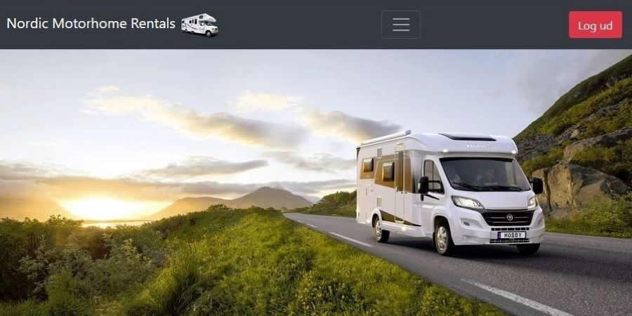

### Features

- Authentication and authorization (login, signup, and user roles)
- CRUD operations on motorhomes, reservations, customers, invoices and employees
- Pages with list view of all the above

### Screenshots

### Built with

- Java
- Spring Boot
- JPA/Hibernate
- MySQL
- HTML5
- Bootstrap CSS

### What I learned

Group project for the first year exam. We got to try out JPA/Hibernate ORM for database operations which was very nice. Then we learned how to integrate bootstrap css into a web app built with Spring Boot.
